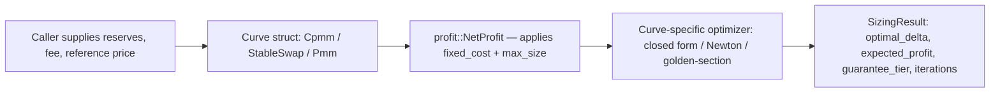

# Architecture

This document is the naming and boundary authority for `optimal-sizing`. Every other document (`API.md`, `TESTING.md`) references the names defined here rather than redefining them. If a name here disagrees with a name anywhere else, this document wins.

## What this document owns

Crate layout, module boundaries, data flow between components, the numeric-type decision, and the explicit non-goals for v1. It does not own function signatures (`API.md`) or the test plan (`TESTING.md`).

## Workspace layout

```
optimal-sizing/
├── Cargo.toml                         # workspace root, resolver = "2"
├── crates/
│   ├── sizing-core/
│   │   ├── Cargo.toml
│   │   └── src/
│   │       ├── lib.rs
│   │       ├── traits.rs              # PricingCurve, SizingAlgorithm
│   │       ├── types.rs               # SizingConstraints, SizingResult, GuaranteeTier
│   │       ├── error.rs               # SizingError
│   │       ├── profit.rs              # NetProfit — fixed-cost domain restriction, shared across curves
│   │       ├── slippage.rs            # SlippageBound — added, see § SlippageBound / gas_aware_fixed_cost
│   │       ├── gas.rs                 # gas_aware_fixed_cost — added, see § SlippageBound / gas_aware_fixed_cost
│   │       └── curves/
│   │           ├── mod.rs
│   │           ├── cpmm.rs            # Cpmm struct — closed-form sizing
│   │           ├── stableswap.rs      # StableSwap struct — Newton's method
│   │           ├── pmm.rs             # Pmm struct — golden-section search
│   │           └── concentrated_liquidity.rs # added — see § ConcentratedLiquidity
│   ├── sizing-bench/
│   │   └── src/main.rs                # grid-search comparison harness, writes docs/benchmark-report.md
│   ├── sizing-integration/
│   │   └── src/main.rs                # real reference integration — see § Reference integration
│   ├── sizing-router/
│   │   └── src/
│   │       ├── lib.rs
│   │       └── route.rs               # Leg enum, Route, joint 2-hop sizing — see § sizing-router
│   ├── sizing-wasm/
│   │   └── src/lib.rs                 # wasm-bindgen wrapper — see § sizing-wasm / sizing-py
│   ├── sizing-py/
│   │   └── src/lib.rs                 # PyO3 wrapper — see § sizing-wasm / sizing-py
│   └── sizing-cli/
│       └── src/main.rs                # thin CLI over all of the above — see § sizing-cli
└── docs/
    ├── whitepaper.md
    ├── ARCHITECTURE.md                # this file
    ├── API.md
    ├── TESTING.md
    └── benchmark-report.md            # generated by sizing-bench, not hand-written
```

## Module boundaries

| Module | Owns | Does not own |
|---|---|---|
| `sizing-core::curves::cpmm` | Constant-product closed-form sizing, concavity-based optimum | Fixed-cost handling (delegates to `profit::NetProfit`) |
| `sizing-core::curves::stableswap` | Newton's method on the StableSwap invariant, root-finding for trade size | Multi-asset pools beyond the `n`-asset invariant defined in `whitepaper.md § 5.2` |
| `sizing-core::curves::pmm` | Golden-section search, unimodality pre-check | Any PMM formula beyond WooFi v2's published pricing model (see `whitepaper.md § 5.3`) |
| `sizing-core::profit` | Fixed-cost domain restriction, capacity-constraint clipping — shared post-processing applied identically to all three curves | Curve-specific quoting logic |
| `sizing-core::traits` | `PricingCurve`, `SizingAlgorithm` — the only two public traits | Concrete curve implementations |
| `sizing-bench` | Benchmarking `sizing-core` against a naive grid-search baseline it implements internally, for comparison only | Anything published as part of the public API |
| `sizing-integration` | A real, working integration that fetches live on-chain reserve state (Ethereum mainnet, via an RPC endpoint supplied through the `RPC_URL` environment variable) for one Uniswap v2 pool and one Curve pool, and calls `sizing-core` against that real state | Any RPC, transport, or chain-specific code inside `sizing-core` itself |
| `sizing-router` | Composing 2 pools (possibly different curve families) into a single route, and a joint search over the first leg's input size — see § `sizing-router` | Fetching state itself (routes are built from caller-supplied `Cpmm`/`StableSwap`/`Pmm` values, same I/O-free discipline as `sizing-core`); any claim that a composed result is `ProvenOptimal` — it is not, regardless of the legs' individual tiers |

## Data flow



`sizing-core` never fetches state itself. Reserves, fee, and reference price are always caller-supplied arguments. `sizing-integration` is the only crate in this workspace that performs network I/O, and it exists specifically so the library is demonstrated against real state rather than fabricated numbers — see § Reference integration.

## Numeric type

All public APIs use `rust_decimal::Decimal` (`rust_decimal = "1.36"`). Floats are not used anywhere in `sizing-core`'s public interface or internal math. Rationale: floating-point error compounds in Newton's-method iteration and becomes material at the reserve ratios and `A` values StableSwap pools actually run at in production; a fixed-point decimal type removes that failure class entirely. This is a locked decision for v1 — changing it would require updating this document first.

## Reference integration (not a demo)

`sizing-integration` is a real integration, not mock data: it connects to a live Ethereum mainnet RPC endpoint (`RPC_URL` env var, no default — the build must fail loudly if unset, never silently fall back to a hardcoded value), reads live reserves from one named Uniswap v2 pool and one named Curve pool via their actual on-chain view functions, and runs `sizing-core`'s sizing calculation against that live state, printing the result. It has no strategy logic and executes no transactions — it is read-only, real-data proof that the math works against real reserves, not a toy example with invented numbers.

Exact pools used (locked, do not substitute without updating this document):

| Protocol | Pool | Address | Chain |
|---|---|---|---|
| Uniswap v2 | USDC/WETH | `0xB4e16d0168e52d35CaCD2c6185b44281Ec28C9Dc` | Ethereum Mainnet |
| Curve | 3pool (DAI/USDC/USDT) | `0xbEbc44782C7dB0a1A60Cb6fe97d0b483032FF1C7` | Ethereum Mainnet |

**`reference_price` sourcing (added — Session 7, previously unspecified).** This integration has no second, independent price oracle wired in — it reads one pool's own state and runs `sizing-core` against it, nothing more. Using a pool's own exact marginal price as `reference_price` would deterministically return `SizingError::NoArbitrageOpportunity` (a correct result, but not a demonstrable `SizingResult`). A documented 0.1% synthetic offset off each pool's own computed marginal price is applied by default purely to produce a demonstrable `Ok(SizingResult)` — this is not a claim that either pool is actually mispriced by 0.1% in reality. **Escape hatch (added per external review):** `UNISWAP_REFERENCE_PRICE` / `CURVE_REFERENCE_PRICE` env vars let a caller supply a real external price instead, for a genuine signal rather than the canned demo offset.

**Multicall batching (added — `ROADMAP.md` "Multicall batching for `sizing-integration`").** Reads are batched via the `Multicall3` contract (`0xcA11bde05977b3631167028862bE2a173976CA11`, identical address on essentially every EVM chain) instead of issued as separate `eth_call`s. This reduces the integration from 10 separate round-trips to **3**, not to 1 — the roadmap entry's "one batched call, not N sequential ones" undersold a real data dependency: Uniswap's `decimals()` calls need `token0()`/`token1()`'s results first (which token is which isn't known until that call returns), so Uniswap batches as 2 round-trips (`getReserves+token0+token1`, then `decimals×2`); Curve 3pool's 5 reads (`balances×3`, `A`, `fee`) have no interdependency and batch into 1. The `aggregate3` selector (`0x82ad56cb`) was computed via real keccak256, same discipline as this file's existing selectors — see `multicall.rs`'s module doc. **Not verified end-to-end against a live Multicall3 deployment**, for the same reason nothing else here is (see below) — `multicall.rs`'s ABI encode/decode has unit-test coverage against synthetic data instead.

**Known-risk assumptions in the current implementation (Session 7, unverified — no Ethereum RPC provider was reachable while building this):**
- Curve 3pool's `A()` is read as an unscaled amplification value by default (no `A_PRECISION` division), reasoned from 3pool being one of Curve's original pool implementations (Vyper 0.2.8, predating the `A_PRECISION=100` scaling later pool versions use) — **not confirmed against live state.** This is the single highest-risk assumption in the integration; verify it first against a block explorer before trusting any output. The program prints both the unscaled and `/100` interpretations of the raw `A()` value on every run (added per external review) so this can be sanity-checked without reading source; `CURVE_A_OVERRIDE=<value>` lets a caller supply the verified-correct value directly instead of trusting the default.
- Uniswap v2's swap fee (0.3%, `fee_retention = 0.997`) and DAI/USDC/USDT's decimals (18/6/6) are hardcoded as well-known, immutable protocol/token constants rather than queried on-chain — same treatment as citing WooFi's published formula elsewhere in this codebase, not an invented value.

## `sizing-router` (added — `ROADMAP.md` "the single highest-value addition: multi-hop routing")

Sizes a 2-hop route: two legs, each one of `Cpmm`, `StableSwap`, or `Pmm` (from `sizing-core`), where leg 2's input is leg 1's output. **Two hops only in this version** — the roadmap's own suggested scope ("two hops first; N-hop composition is a natural v3 once two-hop routing has real tests behind it").

**Why this isn't just "call `optimal_size` twice."** The optimal input size for leg 1 depends on what leg 2's curve looks like at whatever output leg 1 produces — sizing each leg independently against the same `reference_price` and composing the two `SizingResult`s is not, in general, the size that maximizes profit for the *route* taken as a whole. `sizing-router` instead runs a golden-section-style search directly over leg 1's input size, evaluating the *route's* net profit (leg 2's quote of leg 1's output, minus `reference_price` times the input, minus `fixed_cost`) at each candidate — not composing two already-independently-computed `SizingResult`s after the fact.

**Guarantee tier.** A composed route gets `GuaranteeTier::ComposedFrom(Vec<GuaranteeTier>)` (see `docs/API.md § types.rs`), carrying each leg's own tier for transparency, but this is deliberately **not** a claim that the route result is `ProvenOptimal` even when every leg is — concavity doesn't automatically survive composition (a CPMM leg composed with a StableSwap leg isn't provably concave as a joint function of leg-1 input size, even though each leg is well-behaved on its own), so the route-level search is a numerical optimum over the sampled/bracketed domain, not a closed form, regardless of which curves compose it. Treat a `ComposedFrom` result the way you'd treat `EmpiricallyValidated`, not the way you'd treat `ProvenOptimal`, no matter what tiers appear inside it.

**Not built:** N-hop (N > 2) routing, cross-route capital allocation (that's Tier 3's portfolio sizing, a different problem), and any notion of route *discovery* (which pools to chain together) — `sizing-router` sizes a route the caller has already chosen, exactly the same "caller supplies the state, this crate does not go find it" discipline `sizing-core` follows for reserves.

## `sizing-wasm` / `sizing-py` (added — `ROADMAP.md` "WASM bindings" / "Python bindings (PyO3)")

Both are thin, boundary-only wrappers exposing `Cpmm`/`StableSwap`/`Pmm` to a host language that has no native arbitrary-precision decimal type compatible with `rust_decimal::Decimal` — every numeric value crosses the boundary as a string (`sizing-wasm`) or as anything Python can `str()` in, and a real `decimal.Decimal` back out (`sizing-py`), never as `f64`/`float`. Neither crate touches `sizing-core`'s math; they only convert at the edge.

**Verification status differs between the two, and this is stated honestly rather than glossed over:** `sizing-py` was built for real (`cargo build`, not just `cargo check`) and its compiled `.so` was loaded from an actual Python 3.12 interpreter and exercised against all three curves, both `str` and native `decimal.Decimal` inputs, a `max_size` constraint, and the `NoArbitrageOpportunity` error path — a genuine end-to-end run. `sizing-wasm` could not get the same treatment: the `wasm32-unknown-unknown` target wasn't installed in the environment this was built in and wasn't obtainable there (needed `rustup`, which needed network access that environment didn't have), so it's only been `cargo check`-verified against the host target — see `sizing-wasm/src/lib.rs`'s own doc comment for exactly what that does and doesn't prove.

## `ConcentratedLiquidity` (added — `ROADMAP.md` "Concentrated liquidity")

Single tick range only, deliberately: one LP position, not a full multi-tick pool. Uniswap v3's own math means a single position's "virtual reserves" (`L/sqrt(p)`, `L*sqrt(p)`) satisfy the exact same `x*y=k` invariant `Cpmm` already solves — so `ConcentratedLiquidity::optimal_size` reuses `Cpmm`'s closed form directly on those virtual reserves, with the tick boundary folded in as one more `max_size`-style cap on the same concave, closed-form-solvable domain. This is why it earns `GuaranteeTier::ProvenOptimal`, not a numerical tier — it's genuinely the same proof, not an approximation of it. Cross-validated in `concentrated_liquidity.rs`'s own tests against `Cpmm` directly (construct a `Cpmm` from the same virtual reserves, confirm identical results when the tick boundary doesn't bind).

A trade that would cross the position's tick boundary returns `SizingError::InvalidReserves` rather than silently continuing into an adjacent tick's liquidity — this crate has no way to know what liquidity (if any) sits in the next tick, so pretending to fill across the boundary would misreport the trade. **Multi-tick crossing is out of scope for this version** — a real explicit non-goal, not an oversight; see the list below.

## `sizing-cli` (added — `ROADMAP.md` "A `sizing-cli` binary")

A thin CLI over every curve in `sizing-core` plus a `route-2hop-cpmm` subcommand over `sizing-router` — no library/Rust project required for a one-off check, matching the roadmap entry's own example usage exactly (`sizing-cli cpmm --x 1200000 --y 800000 --fee 0.997 --price 0.60`). All 6 subcommands (`cpmm`, `stableswap`, `pmm`, `concentrated-liquidity`, `route-2hop-cpmm`, and the shared error path) have been run for real, not just compile-checked. **Not built:** CLI flags for `StableSwap`/`Pmm` route legs (only CPMM-CPMM routes are exposed) — flagged as a real gap, not silently limited.

## `SlippageBound` / `gas_aware_fixed_cost` (added — `ROADMAP.md` "Slippage / staleness bound" and "Gas-price-aware `fixed_cost`")

Two small, independent, pure-math additions to `sizing-core`:

- **`SlippageBound::from_quote`** computes a worst-case `min_amount_out` from an already-quoted output and a caller-supplied staleness fraction. This is deliberately *not* a curve-exact re-solve at hypothetically-moved reserves (that would need a `with_moved_reserves`-style method no curve exposes today) — it applies the staleness fraction directly to the quoted output instead, documented as an approximation rather than passed off as curve-exact. See `slippage.rs`'s own module doc.
- **`gas_aware_fixed_cost`** is a pure unit-conversion helper (`gas_price_wei * gas_units_per_swap / 1e18 * native_token_price_in_output_units`), not a calibrated gas-units estimator — `gas_units_per_swap` is a required caller argument, not a per-curve-family default this function invents, The roadmap entry itself notes this should "ideally [be] calibrated from real transaction receipts," which no environment used so far has had access to.

Neither changes `SizingConstraints.fixed_cost`'s existing behavior — both are opt-in helpers a caller uses to *compute* a value they then pass in themselves, same discipline the roadmap entry calls for.

## Fixes from a later code review

An external review (a static read of the codebase, without a compiler available) found several real issues. Each was independently re-verified against the actual code (and, in two cases, corrected or narrowed) before fixing — see each item below for what verification looked like. Full details live as doc comments at each fix site; this section is the index.

- **`StableSwap::quote()` re-solving `D` from scratch every call** (`curves/stableswap.rs`) — confirmed real: `optimal_size`'s derivative closure called `quote()` twice per evaluation, tens of times, each independently re-running `solve_d`'s 255-iteration-capped Newton's-method solve for a value (`D`) that only depends on `reserves`/`amplification`, not the trade size. Fixed by memoizing `D` once per `optimal_size` call via a new private `quote_with_d`, safe specifically because Rust's borrow checker guarantees `self` can't mutate during that call (so `D` genuinely can't go stale mid-call) — but *not* cached as a struct field, since `reserves`/`amplification` are public and mutable between separate calls, and a struct-level cache would go stale. Proven, not just claimed: `solve_d_call_count_drops_from_dozens_to_one_after_memoization` uses an instrumented atomic counter to assert the call count is exactly 1 (not dozens) after one `optimal_size` call, and `standalone_quote_calls_still_each_solve_d_independently` proves the no-staleness property from the other direction. **Measured speedup, reported honestly:** `measure_before_after_call_pattern_timing` found ~1.5x for a representative 3-asset pool — smaller than a naive "eliminate 80 redundant solves" framing suggests, because `solve_new_output_reserve` (a separate, comparably-expensive Newton solve that genuinely depends on the specific trade size and can't be memoized) still runs every call, correctly.
- **Finite-difference derivative step scaled to `quote()`'s own noise floor** (`curves/stableswap.rs`) — confirmed real: the step was `self.reserves[0] * NEWTON_TOLERANCE`, the same relative scale as `quote()`'s own ~1e-6 convergence tolerance, risking catastrophic cancellation (subtracting two similarly-noisy values over a similarly-narrow gap). Fixed by widening the step to `sqrt(NEWTON_TOLERANCE)` (~1e-3), the standard rule of thumb. An analytic derivative of `solve_new_output_reserve`'s implicit equation would remove the tradeoff entirely but is separately-scoped, larger work, not attempted this session.
- **PMM's unimodality check not distinguishing concave from convex** (`curves/pmm.rs`) — confirmed real, and *analytically*, not just from the review's say-so: this file's own `reverse_sell_base(Δ) = Δ*p/(1-k*Δ*p)` has `f''(Δ) = 2*k*p²/(1-k*Δ*p)³ > 0` for `k, p > 0`, genuinely convex. The old check only verified curvature never *flipped* sign, so a search interval confined entirely to the (convex) reverse regime reported `unimodality_confirmed: true` — a real false positive, since golden-section search (as implemented) has no correctness guarantee for a convex profit function's boundary-attained maximum. Fixed by additionally requiring the observed sign be non-positive. Regression test `reverse_regime_only_interval_is_correctly_flagged_as_non_concave` constructs the exact failure case by hand. **Fixing this surfaced two further, independent bugs**, found only because the stricter check let `pmm_proptest.rs` actually explore its parameter space for the first time (previously ~100% of draws were silently rejected, passing by luck rather than by covering the space):
  - `pmm_proptest.rs`'s own generator comment claimed to produce "at or near balance" pools, but `quote_multiplier in 1.0..5.0` actually created crossover deltas up to 4x `base_reserve`, landing in the (convex) reverse regime for most draws — fixed the generator to actually match its stated intent (`0.5..1.0`, guaranteeing `crossover_delta = 0`).
  - Once genuinely valid cases started flowing through, the grid-search cross-check's tolerance (`0.0001 * optimal_delta`) turned out to be tighter than the grid's own quantization step (`upper / 10_000`) in cases where the true optimum is small relative to `upper` — asserting sub-grid-resolution precision against a coarse reference, not a golden-section bug. Confirmed numerically (Python) before fixing: the observed discrepancy was smaller than half a grid step. Fixed by taking the max of the existing relative tolerance and `2 * grid_step`.
- **`GOLDEN_RATIO_INV` hand-truncated to 10 digits** (`curves/pmm.rs`) — confirmed. Extended to full `Decimal` precision (28 significant digits), and the literal was computed via `Decimal`'s own `.sqrt()` at test-writing time (not transcribed from memory or copied from an external source), so a future edit that drifts the literal fails a test instead of silently reintroducing truncation error.
- **Magic `1000x` search bound in `Pmm::optimal_size`** (`curves/pmm.rs`) — confirmed as a real invented default (the code's own prior comment admitted "no tighter bound is named in API.md/whitepaper.md"). Replaced with `search_upper_bound()`, a new method deriving the bound from two real curve-specific quantities (the pole, computed exactly, and `quote_reserve`'s own hard capacity cap) via the same doubling-bracket pattern already used elsewhere in this codebase (`Cpmm::bisection_fallback`, `StableSwap::optimal_size`, `sizing_router::Route::optimal_size`). Extracting this into its own method also fixed a second, independent problem it surfaced: two tests in `pmm_proptest.rs` had been independently re-deriving the old formula rather than calling into the real implementation, meaning they'd already silently drifted from what `optimal_size` actually computed (passing only because the iteration-count formula they checked is log-based and not very sensitive to the bound's exact value — a fragile coincidence, not a real guarantee). Both now call `search_upper_bound()` directly.
- **Claim checked and found overstated: root-level docs ship inside the published crates.io package.** Verified with `cargo package --list -p sizing-core`: they don't. Root-level files live outside every crate's own directory, and Cargo's packaging only includes files within a crate's own manifest directory. The review conflated "visible in the GitHub repo" with "shipped in the published package" — these are different things.

## Non-goals for v1 (explicit — do not build these without updating this document first)

- **Multi-hop sizing — AMENDED, no longer a non-goal.** This was v1's stated non-goal; `sizing-router` (see § Workspace layout and § `sizing-router`) now builds it as a new, separate crate that depends on `sizing-core` rather than folding it into `sizing-core` itself. `sizing-core`'s single-pool guarantees (`ProvenOptimal`, `NumericallyGuaranteed`, `EmpiricallyValidated`) are unchanged and still describe exactly what they always did; a composed multi-hop route gets its own, separately-honest `GuaranteeTier::ComposedFrom(Vec<GuaranteeTier>)` rather than inheriting or upgrading any leg's tier — see `docs/API.md § types.rs` and `sizing-router`'s own module doc for why composition doesn't imply joint optimality even when every leg is individually `ProvenOptimal`.
- **Chain/RPC code inside `sizing-core`.** Reserves and prices are arguments. Any future work that would require `sizing-core` to fetch anything itself is out of scope — flag it instead.
- **Strategy or signal logic.** `reference_price` is an opaque input. This library never decides whether a mispricing is worth acting on — it answers "given a mispricing exists at this price, what size," nothing about whether or when to check.
- **Generic PMM abstraction.** Only WooFi v2's published pricing formula is implemented in v1 (see `whitepaper.md § 5.3`). A generic "any PMM-like curve" trait is out of scope until there is a second concrete PMM formula to generalize from.
- **StableSwap pools with dynamic/ramping `A`.** v1 takes `A` as a fixed input at call time. Curve's `A`-ramping mechanism (gradual changes to `A` over time) is not modeled — the caller is responsible for supplying the current `A` value.
- **Multi-tick concentrated-liquidity crossing.** `ConcentratedLiquidity` (see § `ConcentratedLiquidity`) sizes exactly one active tick range. A trade that would cross into an adjacent tick's liquidity is rejected, not simulated — this crate has no representation of what liquidity (if any) sits beyond the current position's bounds.
