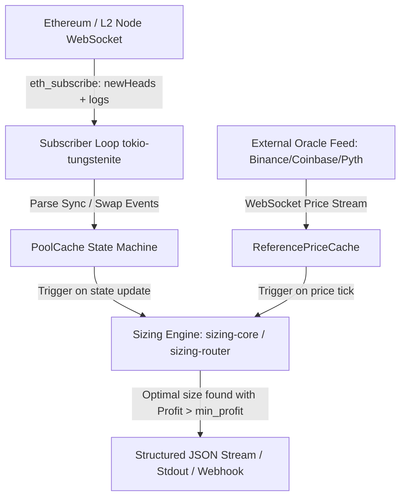

# Real-Time Streaming Sizing Daemon: `sizing-watch`

> **Authority:** This document defines the architecture, networking protocols, event state machine, caching rules, and resilience guarantees for the `sizing-watch` streaming binary. All RPC subscriptions, state transition tables, and error recovery policies are explicitly specified.

---

## 1. Architecture Overview

`sizing-watch` is a high-throughput, low-latency background daemon that maintains synchronized in-memory state for watched liquidity pools and continuously recalculates optimal sizing opportunities upon every block header or state change.



---

## 2. Configuration & CLI Interface

### 2.1 Configuration File (`watch_config.json`)
```json
{
  "ws_rpc_url": "wss://mainnet.infura.io/ws/v3/${INFURA_API_KEY}",
  "oracle_ws_url": "wss://stream.binance.com:9443/ws/ethusdc@ticker",
  "min_profit_usd": "5.00",
  "default_fixed_cost_gas_units": "150000",
  "pools": [
    {
      "id": "uniswap_v2_usdc_weth",
      "address": "0xB4e16d0168e52d35CaCD2c6185b44281Ec28C9Dc",
      "curve_type": "cpmm",
      "fee_retention": "0.997",
      "token0_decimals": 6,
      "token1_decimals": 18,
      "input_token_index": 0,
      "output_token_index": 1
    },
    {
      "id": "curve_3pool",
      "address": "0xbEbc44782C7dB0a1A60Cb6fe97d0b483032FF1C7",
      "curve_type": "stableswap",
      "amplification": "100",
      "fee_retention": "0.9996",
      "token_decimals": [18, 6, 6],
      "input_token_index": 0,
      "output_token_index": 1
    }
  ],
  "routes": [
    {
      "id": "usdc_weth_3pool_arb",
      "legs": ["uniswap_v2_usdc_weth", "curve_3pool"]
    }
  ]
}
```

### 2.2 Daemon Execution
```bash
sizing-watch --config watch_config.json --log-level info
```

---

## 3. Subscription & Event State Machine

### 3.1 Subscriptions Issued
1. `newHeads`: `{"jsonrpc":"2.0","id":1,"method":"eth_subscribe","params":["newHeads"]}`
2. `logs` (Topic filter for `Sync(uint112,uint112)` selector `0x1c411e9a96e071241c2f21f7726b17ae89e3cab4c78be50e062b03a9fffbbad1` on watched pool addresses).

### 3.2 In-Memory `PoolCache`
```rust
pub struct PoolState {
    pub pool_id: String,
    pub last_block_number: u64,
    pub reserves: Vec<Decimal>,
    pub timestamp: u64,
}
```

### 3.3 State Update Rules
- Upon receiving a `Sync` log: Update corresponding `reserves` immediately in memory.
- Upon receiving a `newHeads` event:
  1. Verify block sequentiality (`block.number == last_block + 1`).
  2. If block gap detected ($\ge 2$ blocks missed) or reorg detected (`block.parent_hash != last_hash`):
     - Mark pool cache as `Stale`.
     - Dispatch batched Multicall3 query to re-fetch canonical reserves for all watched pools.
     - Resume sizing calculations once synchronized.

---

## 4. Sizing Engine & Latency Optimization

### 4.1 Evaluation Trigger
Sizing is re-evaluated when:
1. Any pool's reserve changes.
2. The reference price changes by more than `0.01%` (1 bps threshold).

### 4.2 Performance Target
- Memory Allocation: Zero heap allocations during hot-path evaluation.
- Solver Latency:
  - CPMM / CLMM: $< 15\,\mu s$.
  - StableSwap (Newton solver with memoized $D$): $< 650\,\mu s$.
  - Multi-hop router (2-hop golden-section): $< 250\,\mu s$.
- Total Event-to-Output Latency Target: $< 1.0\,\text{ms}$.

---

## 5. Output Stream Format

When an arbitrage opportunity with expected profit $\ge \text{min\_profit}$ is detected, `sizing-watch` emits a single-line JSON payload to stdout:

```json
{
  "event": "OPPORTUNITY_DETECTED",
  "timestamp_ns": 1788109382193829100,
  "block_number": 20654312,
  "target": "usdc_weth_3pool_arb",
  "optimal_delta": "45210.551928410293",
  "expected_profit_usd": "48.25",
  "guarantee_tier": "ComposedFrom([ProvenOptimal, NumericallyGuaranteed])",
  "reference_price": "0.9985",
  "gas_cost_usd": "4.20",
  "pool_state_block": 20654312
}
```
