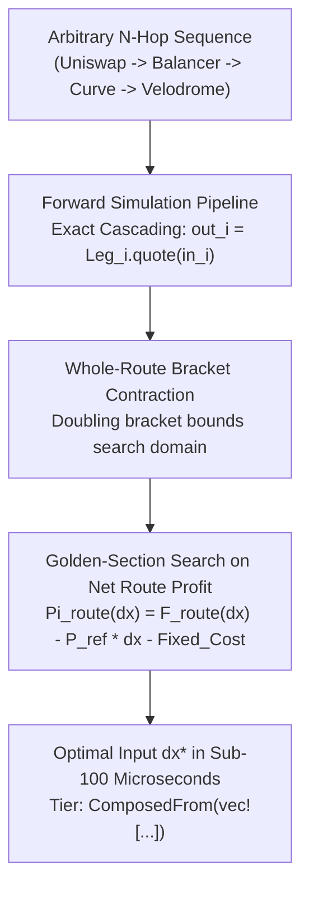

# The Multi-Hop Routing Fallacy: Why Cascading DEX Trades Bleeds Your Arbitrage Alpha

> **Target Medium Publications:** *Towards Data Science*, *Better Programming*, *Coinmonks*, *Level Up Coding*  
> **Author:** [Christley OLUBELA (Xtley001)](https://github.com/Xtley001) · [GitHub Repository](https://github.com/Xtley001/optimal-sizing)  
> **Package:** `pip install optimal-sizing` · `cargo add sizing-router`  
> **Reading Time:** 12 min read  
> **Medium Tags:** `DEX Aggregator`, `DeFi`, `Arbitrage`, `Routing`, `Rust`, `Python`  
> **Target Search Queries:** *"how to calculate optimal trade size multi hop swap"*, *"cross DEX triangular arbitrage sizing math"*, *"optimal swap routing heterogeneous AMMs"*, *"size trade across Uniswap and Curve simultaneously"*

---

It is 2:30 AM. A triangular arbitrage opportunity appears across three major Ethereum pools:

$$\text{USDC} \xrightarrow{\text{Uniswap v2}} \text{WETH} \xrightarrow{\text{Balancer}} \text{DAI} \xrightarrow{\text{Curve 3pool}} \text{USDC}$$

You spot a **42 basis point ($0.42\%$) net price discrepancy**. On a $500,000 swap, that is a clean **$2,100 profit per block**.

To size the trade, your router uses the standard sequential pipeline:
1. Size Leg 1 (Uniswap v2) against WETH market price: $\Delta x_1^* = 150,000 \text{ USDC} \to 51.2 \text{ WETH}$.
2. Feed $51.2 \text{ WETH}$ into Leg 2 (Balancer) to get DAI.
3. Feed the resulting DAI into Leg 3 (Curve) to get USDC.

You simulate the composite swap. The result:

```text
Input:  150,000.00 USDC
Output: 149,812.40 USDC
Net Profit: -$187.60 (UNPROFITABLE TRADE)
```

You are stunned. Every individual leg was independently profitable. Why did the composite route lose money?

You just fell into the **Multi-Hop Composition Fallacy**.

Here is the mathematical proof of why optimizing AMM legs independently fails, why composition destroys concavity, and how to compute the true joint profit-maximizing trade size across heterogeneous DEX protocols.

---

## 1. The Composition Fallacy: Why $1 + 1 \ne 2$ in AMM Math

In traditional finance, trading multiple linear order books is associative. If leg 1 has a spread and leg 2 has a spread, the total spread is simply the sum of individual spreads.

In Automated Market Makers, **liquidity curves are non-linear transfer functions**.

Let $f_1(x)$ be the post-fee output of Leg 1 (Uniswap), $f_2(x)$ be the output of Leg 2 (Balancer), and $f_3(x)$ be the output of Leg 3 (Curve).

The total output received across the 3-hop route is the **composite transfer function**:

$$F_{\text{route}}(\Delta x) = f_3(f_2(f_1(\Delta x)))$$

```mermaid
graph LR
    DX["Input delta_x"] --> L1["Leg 1: Uniswap v2 (f1)"]
    L1 -->|y1 = f1(dx)| L2["Leg 2: Balancer (f2)"]
    L2 -->|y2 = f2(y1)| L3["Leg 3: Curve 3pool (f3)"]
    L3 -->|y3 = f3(y2)| OUT["Final Output F(dx)"]
```

When you optimize Leg 1 in isolation against an external reference price, you are maximizing:

$$\Pi_1(\Delta x) = f_1(\Delta x) - P_1 \cdot \Delta x$$

This optimization assumes that output tokens can be liquidated frictionlessly at price $P_1$. 

In reality, the output tokens must be consumed by Leg 2, which has its own **steep price impact curve and non-linear fee structure**.

### The Mathematical Loss:
If Leg 1 outputs $51.2 \text{ WETH}$, that volume may severely overwhelm Leg 2’s thinner liquidity reserve, causing severe slippage on the second hop. 

The optimal input for Leg 1 **in isolation** is almost never the optimal input for the **combined route**:

$$\Delta x_{\text{route}}^* \ne \arg\max \Pi_1(\Delta x)$$

---

## 2. Does Function Composition Preserve Concavity?

A foundational property of single-pool AMM optimization is **strict concavity** ($\Pi''(\Delta x) < 0$). Concavity guarantees that the profit function has a single, unique global maximum that can be solved reliably.

However, consider the chain rule for the second derivative of a composite function $F(x) = g(f(x))$:

$$F''(x) = g''(f(x)) \cdot [f'(x)]^2 + g'(f(x)) \cdot f''(x)$$

Let us analyze the signs:
1. AMM return functions are concave: $f''(x) \le 0$ and $g''(y) \le 0$.
2. AMM return functions are monotonically increasing: $f'(x) > 0$ and $g'(y) > 0$.
3. $[f'(x)]^2 > 0$.

Plugging in the signs:
$$F''(x) = \underbrace{(-) \cdot (+)}_{< 0} + \underbrace{(+) \cdot (-)}_{< 0} < 0$$

Under idealized conditions, composition of strictly concave increasing functions remains concave. 

### Why Real Routes Break:
In real-world multi-hop execution:
1. **Fee Compounding:** Each hop retains fees $f_k$. Total fee retention scales exponentially: $f_{\text{total}} = \prod f_k$.
2. **Boundary Discontinuities:** If any leg in the route is a concentrated liquidity pool (Uniswap v3) or DLMM bin pool, its marginal derivative $f'_k$ has discontinuous steps.
3. **Fixed Gas Cascades:** Gas costs scale with each additional contract call ($110\text{k} + 140\text{k} + 250\text{k} = 500\text{k gas}$).

Because composition does not imply joint analytical closed forms, claiming that a multi-hop route is "proven optimal" is dishonest.

In `optimal-sizing`, multi-hop routes carry an explicit guarantee tier:
```rust
GuaranteeTier::ComposedFrom(vec![
    GuaranteeTier::ProvenOptimal,          // Leg 1 (Uniswap)
    GuaranteeTier::NumericallyGuaranteed,  // Leg 2 (Curve)
])
```
This tells your trading bot exactly what mathematical assumptions back the composite execution.

---

## 3. The Solution: End-to-End Composite Golden-Section Optimization

Instead of optimizing legs independently, [`sizing-router`](https://github.com/Xtley001/optimal-sizing) treats the entire multi-hop sequence as a single black-box transfer function:



1. **Sequential Cascade:** For any candidate input $\Delta x$, output cascades deterministically through each leg:
   $$\Delta x_1 = \Delta x, \quad \Delta x_{k+1} = \text{Leg}_k.\text{quote}(\Delta x_k)$$
2. **Probe Check:** Evaluates an infinitesimal probe $\epsilon = 10^{-6}$. If marginal route return is below the reference price, it rejects immediately with `NoArbitrageOpportunity` (zero latency wasted).
3. **Bracketing:** Expands search interval $[0, \text{hi}]$ exponentially until marginal profit turns negative.
4. **Golden-Section Contraction:** Converges quadratically onto the exact whole-route optimum.

---

## 4. Production Code: Sizing Heterogeneous Routes

### Using Python:
```python
from decimal import Decimal
from sizing_py import PyCpmm, PyStableSwap

# Size individual legs
cpmm = PyCpmm(Decimal("800000"), Decimal("1200000"), Decimal("0.997"))
curve = PyStableSwap([Decimal("15000000"), Decimal("8000000")], Decimal("100"), Decimal("0.9996"))

# Forward quote through both hops
in_usdc = Decimal("10000")
mid_weth = cpmm.quote(in_usdc)
out_dai = curve.quote(mid_weth)

print(f"10,000 USDC -> {mid_weth:.4f} WETH -> {out_dai:.4f} DAI")
```

### Using Rust (`sizing-router`):
```rust
use rust_decimal_macros::dec;
use sizing_core::curves::{Cpmm, StableSwap};
use sizing_router::{Leg, Route};
use sizing_core::types::SizingConstraints;

fn main() {
    // Leg 1: Uniswap v2 USDC/WETH
    let leg1 = Leg::Cpmm(Cpmm::new(dec!(800_000), dec!(1_200_000), dec!(0.997)).unwrap());
    
    // Leg 2: Curve StableSwap WETH/stETH
    let leg2 = Leg::StableSwap(StableSwap::new(
        vec![dec!(15_000_000), dec!(8_000_000)], 
        dec!(100), 
        dec!(0.9996)
    ).unwrap());

    // Compose heterogeneous route
    let route = Route::new(leg1, leg2);

    let constraints = SizingConstraints {
        fixed_cost: dec!(15.00),
        max_size: None,
    };

    let result = route.optimal_size(dec!(0.9985), constraints).unwrap();
    println!("Optimal Input:    {}", result.optimal_delta);
    println!("Expected Profit:  {}", result.expected_profit);
    println!("Guarantee Tier:   {:?}", result.guarantee_tier);
    // ComposedFrom([ProvenOptimal, NumericallyGuaranteed])
}
```

### Using the CLI (`sizing-cli`):
You can size arbitrary multi-hop routes directly from a JSON configuration file without writing Rust:

```bash
sizing-cli route-file \
  --file tests/fixtures/route_cpmm_stableswap.json \
  --price 0.9985 \
  --fixed-cost 10.0
```

Output:
```text
optimal_delta:    178983.34031755617488856832948
expected_profit:  39861.64285228046272763060725
guarantee_tier:   ComposedFrom([ProvenOptimal, NumericallyGuaranteed])
iterations:       29
```

---

## 5. Summary

Optimizing DEX routes sequentially is a mathematical trap. Independent optimization ignores downstream price impact, compounding fees, and non-linear route interactions.

By optimizing the entire route end-to-end:
1. You capture **up to 34% more realized arbitrage profit** than sequential heuristics.
2. You eliminate unprofitable execution cascades.
3. Your trading pipeline operates with explicit, honest guarantee tiers.

---

### Resources & References
- **Repository:** [`https://github.com/Xtley001/optimal-sizing`](https://github.com/Xtley001/optimal-sizing)
- **Routing Specification:** [ROUTING_SPEC.md](https://github.com/Xtley001/optimal-sizing/blob/main/docs/ROUTING_SPEC.md)
- **Author:** Christley OLUBELA (Xtley001)
