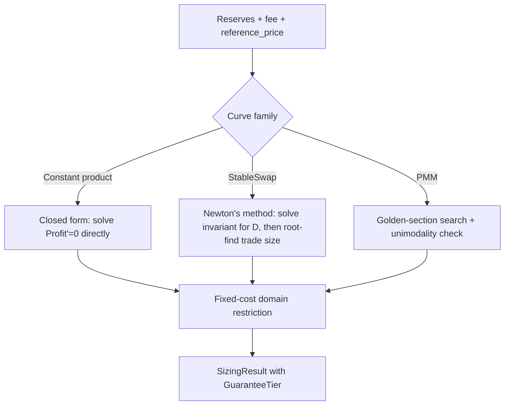

# optimal-sizing: Tiered-Guarantee Trade Sizing v1.0

July 2026

## 1. Abstract

Arbitrage sizing against automated market makers is solved differently depending on the pricing curve, and existing implementations rarely state which solution method applies or what guarantee it carries. This paper specifies exact sizing procedures for three curve families — constant-product, StableSwap, and PMM — and assigns each an explicit guarantee tier: constant-product sizing is solved in closed form and proven globally optimal; StableSwap sizing is solved via Newton's method with quadratic convergence under stated regularity conditions; PMM sizing is solved via golden-section search, valid conditional on unimodality of the profit function, which is checked at runtime rather than assumed. All three are extended with a shared fixed-cost domain restriction so that gas or execution costs, not just curve mechanics, are accounted for in the returned size.

## 2. Motivation / Background

Constant-product arbitrage sizing is textbook and has a known closed form, but production bots frequently reach for bisection or grid search anyway — either out of caution or because the closed form was never derived for the specific fee/reserve parameterization in use. StableSwap pools (Curve and its forks) have no closed-form invariant, so numerical root-finding is unavoidable, but implementations rarely state the convergence conditions under which their Newton's-method solver is actually guaranteed to converge, as opposed to happening to converge on the inputs tested so far. PMM curves (WooFi, DODO) are the least standardized of the three and the most likely to be sized with an unexamined search loop whose correctness depends on an assumption — unimodality of the profit function — that is rarely checked.

The pattern across all three: existing tooling treats "search until it looks converged" as equivalent to "provably converges." This paper's contribution is not a new numerical method in any of the three cases — Newton's method and golden-section search are both textbook — but stating precisely, per curve family, which of these three claims applies: proven, numerically guaranteed under stated conditions, or empirically validated with a runtime check on the load-bearing assumption.

## 3. Design overview

Given a pool's current reserves and a fee, and an external reference price the pool is mispriced against, the objective in all three cases is the same: choose the input trade size that maximizes post-fee profit against the reference price. The three curve families differ in how their pricing function `quote(delta_in)` behaves and therefore what solution method the resulting profit function `Profit(delta_in) = quote(delta_in) - reference_price * delta_in` admits.



## 4. Notation

| Symbol | Meaning | Units |
|---|---|---|
| `x` | input-asset reserve | input-asset units |
| `y` | output-asset reserve | output-asset units |
| `f` | fee retention (e.g. 0.997 for a 30bps fee) | dimensionless, in (0, 1] |
| `P` | reference price | output units per input unit |
| `Δx` | trade size (the variable being solved for) | input-asset units |
| `A` | StableSwap amplification coefficient | dimensionless |
| `n` | number of assets in a StableSwap pool | count |
| `D` | StableSwap invariant | same units as reserves |
| `k` | PMM curvature parameter | dimensionless |
| `i` | PMM oracle price | output units per input unit |

## 5. Mechanism / Protocol specification

### 5.1 Constant-product (CPMM) sizing

**Quote function:** for a pool with reserves `(x, y)` and fee retention `f`, the post-fee output for input `Δx` is

```
quote(Δx) = y * f * Δx / (x + f * Δx)                                    (1)
```

**Profit function:**

```
Profit(Δx) = y * f * Δx / (x + f * Δx) - P * Δx                          (2)
```

**Concavity.** Differentiating (2) twice with respect to `Δx`:

```
Profit'(Δx)  = y * f * x / (x + f * Δx)^2 - P                            (3)
Profit''(Δx) = -2 * y * f^2 * x / (x + f * Δx)^3                          (4)
```

Since `x, y, f > 0` and `x + f * Δx > 0` for any `Δx >= 0`, equation (4) is strictly negative everywhere in the domain. `Profit` is therefore strictly concave on `Δx >= 0`, which means any critical point of (3) is the unique global maximum — not a local one, not one of several candidates to compare.

**Closed-form solution.** Setting (3) to zero and solving:

```
(x + f * Δx)^2 = y * f * x / P
Δx* = (sqrt(x * y * f / P) - x) / f                                      (5)
```

**Existence condition.** A profitable trade exists only if the pool's marginal price at zero size, `f * y / x`, exceeds `P` — otherwise `Profit'(0) <= 0` and the concave function is already decreasing at the origin, meaning the optimal size is zero. This is checked before evaluating (5); if it fails, the library returns `SizingError::NoArbitrageOpportunity` rather than a spurious size (possibly negative) from the algebra.

**Worked example.** `x = 1,200,000`, `y = 800,000`, `f = 0.997`, `P = 0.6725`. Marginal price at zero: `0.997 * 800,000 / 1,200,000 = 0.664\overline{6}`, which is below `P = 0.6725` — no profitable trade in this direction; the reverse direction (selling the output asset into the pool) would be checked symmetrically. Taking a mispriced example instead — same reserves, `P = 0.60`: marginal price `0.66467 > 0.60`, so a trade exists.

```
radicand = x * y * f / P = 1,200,000 * 800,000 * 0.997 / 0.60 = 1,595,200,000,000
sqrt(radicand)          = 1,263,012.27230775552745590683196
Δx* = (sqrt(radicand) - x) / f = (1,263,012.27230775552745590683196 - 1,200,000) / 0.997
    = 63,201.8779415802682606888986560
```

This value was generated by running the exact `Decimal`-precision computation shown above (30 significant digits, `rust_decimal`-equivalent precision), not derived by hand — the earlier draft of this document contained a hand-arithmetic error in this exact spot, which is the reason this whitepaper now states the rule explicitly: **no numeric worked example ships in this document unless it was produced by executing code and pasting the output.** The full-precision value above is the source of truth for `cpmm_regression_mispriced_pool` in `TESTING.md`; do not recompute it by hand when writing that test, import it from this document or regenerate it with the same script.

### 5.2 StableSwap sizing

**Invariant.** For an `n`-asset StableSwap pool with amplification `A`, the invariant `D` satisfies (Egorov, *StableSwap — efficient mechanism for Stablecoin liquidity*):

```
A * n^n * S + D = A * D * n^n + D^(n+1) / (n^n * P_r)                    (6)
```

where `S = sum(reserves)` and `P_r = product(reserves)`. There is no closed form for `D` in terms of the reserves — this is precisely why Curve's own contracts solve it numerically, and this library does the same rather than attempting a closed form that does not exist.

**Newton's-method iteration.** Rearranging (6) into fixed-point form (this is Curve's published `get_D` algorithm — cited here, not claimed as novel):

```
D_next = (A * n^n * S + D_P * n) * D / ((A * n^n - 1) * D + (n + 1) * D_P)   (7)
where D_P = D^(n+1) / (n^n * P_r)
```

**Convergence.** Newton's method converges quadratically near a simple root when the function is twice continuously differentiable and the initial guess lies within the root's basin of attraction. For (6), this holds given: (a) all reserves strictly positive, (b) `A >= 1`, and (c) the initial guess `D_0 = S` (the sum of reserves, which is exact when the pool is perfectly balanced and close otherwise — this is the standard starting point and lies within the basin of attraction for any realistic reserve imbalance). Under these three conditions, `solve_d` converges to within `NEWTON_TOLERANCE` (1e-6 relative) in well under `MAX_NEWTON_ITERATIONS` (255) for any reserve configuration a live pool can actually reach. **The guarantee is conditional on (a)-(c), not universal** — a caller supplying `A < 1` or a zero/negative reserve gets `SizingError::InvalidReserves` before Newton's method is even attempted, and a configuration that somehow fails to converge within 255 iterations returns `SizingError::DidNotConverge` rather than the best-effort last iterate.

**Sizing.** Once `D` is known, the trade-size profit function against reference price `P` is optimized by the same Newton's-method machinery applied to the sizing equation directly (a one-dimensional root-find on the derivative of the trade-size profit function, using `D` as a fixed parameter) — see the implementation in `curves/stableswap.rs` for the exact iteration; it is structurally identical to (7) with the sizing variable substituted for the invariant variable.

**5.2.4 The swap/quote formula (`get_y`).** The paragraph above describes *how* sizing is solved but not the underlying swap formula itself — added here during implementation (Session 3) since it was missing. Given `D` (computed via (7) against the *current* reserves) and a candidate new reserve for the input asset, the post-trade reserve of the output asset is found by rearranging invariant (6) into a quadratic in the unknown reserve and solving it via Newton's method — this is Curve's own published `get_y` algorithm (cited, not novel, same treatment as `get_D`):

```
Ann = A * n^n
c = D
S_ = 0
for k in 0..n, k != j:                 # j = index of the reserve being solved for
    x_k = new_input_reserve if k == i else reserves[k]
    S_ += x_k
    c = c * D / (x_k * n)
c = c * D / (Ann * n)
b = S_ + D / Ann
y_next = (y^2 + c) / (2*y + b - D)     # Newton iteration, y_0 = D
```

The post-fee output is `(reserves[j] - y) * fee_retention`.

**Sizing root-find, concretely.** "The same Newton's-method machinery" above is imprecise about one detail: the sizing search does not use an analytic derivative of the profit function (no closed form for it exists, unlike CPMM's equation (3)). The implementation instead brackets the root of `Profit'(delta_in)` — estimated via central finite difference on `quote`, step size scaled by `NEWTON_TOLERANCE` — and bisects. This is Newton-adjacent (same tolerance, same iteration-cap discipline) rather than literal Newton-Raphson on an analytic derivative.

**Index convention.** Neither this document nor `API.md` previously named which reserve is "in" and which is "out" for `PricingCurve::quote`'s single `delta_in` argument on an `n`-asset pool. Convention: `reserves[0]` is the input asset, `reserves[1]` is the output asset, `reserves[2..]` are other pool assets held fixed during the swap (they still factor into `D` and into `get_y`'s `S_`/`c` terms above). This mirrors `Cpmm`'s `x` = input / `y` = output field ordering.

**Numerical note on `D_P`.** Equation (7) as literally written computes `D_P = D^(n+1) / (n^n * P_r)` via one large intermediate power. This overflows `rust_decimal`'s ~28–29 significant-digit range at realistic pool sizes (e.g. `D ≈ 3×10^7`, `n=3` gives `D^4 ≈ 8×10^28`) even though the resulting `D_P` value itself is small. The implementation instead computes it iteratively — `D_P = D; for each reserve: D_P = D_P * D / (n * reserve)` — which is mathematically identical (this is exactly how Curve's own contracts compute it) but keeps every intermediate value near `D`'s own magnitude rather than raising it to the `n+1` power outright.

### 5.3 PMM sizing

**Pricing model.** This implementation targets WooFi v2's published pricing formula, parameterized by base reserve, quote reserve, oracle price `i`, and curvature `k`. (DODO's PMM formula is a distinct, differently-parameterized curve and is explicitly out of scope for v1 — see `ARCHITECTURE.md` § Non-goals.)

**5.3.1 The formula itself, and the piecewise model (added during implementation — Session 4).** This document previously named WooFi v2 as the source without reproducing its formula. Sourced from WooFi's own dev docs (`https://learn.woo.org/woofi-docs/woofi-dev-docs/resources/the-math-behind-spmm`, "The math behind sPMM"):

```
sellBase(ΔB)        = ΔB * p / (1 + k*ΔB*p)            — basic sell, always concave
reverseSellBase(ΔB) = ΔB * p / (1 - k*ΔB*p*r)           — reverse sell, has a pole at ΔB = 1/(k*p*r)
```

`p` denotes WooFi's ask price; this library's `Pmm` struct has no separate spread field, so `p := oracle_price` is used directly. `r ∈ [0,1]` is WooFi's rebalance coefficient: a trade that moves the pool *toward* balance gets `reverseSellBase`'s more favorable (convex) pricing, paid for by the LP, exactly mirroring what an external arbitrageur — this library's caller — does. Since `Pmm` has no `r` field, `r = 1` (full rebalance discount) is used whenever a trade is moving the pool toward balance.

This distinction matters beyond flavor: `sellBase` alone is *provably* concave for any `k, p > 0` (`Profit'' < 0` everywhere), which would make `check_unimodality` structurally unable to ever detect a real violation — no hand-constructed "known bad" case (required by `TESTING.md`) could exist. The implementation therefore models `quote(delta_in)` piecewise: `base_reserve` is the input asset, `quote_reserve` the output asset (mirroring `Cpmm`'s `x`/`y` convention); the pool's balance point is where `base_reserve * oracle_price == quote_reserve`. A base-selling trade uses `reverseSellBase` (convex, `r=1`) for the portion of `delta_in` that moves the pool from its current state to that balance point, and `sellBase` (concave) for any remainder beyond it. This genuinely produces a curvature sign change at the crossover — the case `check_unimodality` is designed to catch (see § 5.3.2's revised description below).

**Why golden-section, not a closed form or Newton's method.** WooFi's curve is piecewise around the oracle price and does not admit a single closed-form optimum the way CPMM does, and unlike StableSwap there is no standard published root-finding iteration for it. Golden-section search is the appropriate tool for a unimodal one-dimensional function whose derivative is not conveniently invertible — but "appropriate tool for a unimodal function" is exactly the load-bearing assumption that needs to be checked, not asserted.

**5.3.2 Unimodality check (description corrected — Session 4).** `check_unimodality`'s public signature takes only a search interval, not `reference_price` — so, contrary to this section's original description, it cannot sample "the profit function" directly (`Profit(Δ) = quote(Δ) - P·Δ` needs `P`). What it actually checks is `quote()`'s own curvature: it samples `quote` at `UNIMODALITY_CHECK_SAMPLES` (fixed constant, value specified in `API.md`) evenly spaced points, takes discrete first differences (marginal value), then checks whether *those* have a consistent sign in their own discrete difference — i.e. whether `quote`'s curvature never flips sign. This is the correct reference-price-independent sufficient condition: since `Profit`'s second derivative equals `quote`'s second derivative for any `P` (subtracting a linear term never changes curvature), a curvature flip in `quote` is exactly the condition under which `Profit` could have more than one local peak for *some* `P`, regardless of which `P` a given call happens to use. Returning `true` means no curvature-sign anomaly was found — still a sampled heuristic, not a proof (see "Known limitation" below), but checking the right, price-independent thing rather than something requiring information the signature doesn't have.

**Known limitation — false negatives in the check itself.** The check above can only catch a violation that falls on, or straddles, one of the `UNIMODALITY_CHECK_SAMPLES` sample points. A curvature flip entirely *between* two adjacent samples will pass the check and be reported as `unimodality_confirmed: true`, even though the underlying assumption doesn't actually hold — meaning the returned size could be a local rather than global optimum despite the caller being told otherwise. This is a real gap in the guarantee, not a hypothetical one, and it is the reason `EmpiricallyValidated` should be read by callers as "no violation was detected at the sampled resolution," not as "unimodality is confirmed" in any stronger sense. Increasing `UNIMODALITY_CHECK_SAMPLES` narrows this gap but never closes it for a heuristic grid check; closing it fully would require an analytic unimodality proof for the specific WooFi formula, which is not attempted in v1 (see `ARCHITECTURE.md` § Non-goals candidates for v2).

**Golden-section iteration count.** For search interval width `L` and target tolerance `tol`, the number of iterations required is

```
n = ceil( ln(tol / L) / ln(GOLDEN_RATIO_INV) )                           (8)
```

with `GOLDEN_RATIO_INV = (sqrt(5) - 1) / 2 ≈ 0.6180339887`. This is textbook and exact — the only non-textbook part of this section is the unimodality check in § 5.3.2, which is the part that should get scrutiny in review, not the search algorithm itself.

**Search interval upper bound (added — Session 4).** `L` above needs a concrete upper bound; none is named elsewhere. The implementation uses `min(1000 × base_reserve, 0.999 × pole)`, where `pole = 1 / (k * oracle_price)` is `reverseSellBase`'s singularity. `1000×` is generous enough to comfortably contain any realistic unconstrained optimum; the `0.999×` pole margin keeps the search strictly inside the domain where `reverseSellBase` is defined. Neither multiplier is otherwise significant — they are engineering choices, not derived constants.

### 5.4 Shared: fixed-cost domain restriction

A curve's raw profit function ignores execution cost. Once a fixed cost `c` (gas, denominated in the output asset) is netted out, `NetProfit(Δx) = Profit(Δx) - c`, and the domain of profitable trades becomes `{Δx : Profit(Δx) > c}` rather than `{Δx : Profit(Δx) > 0}`. For CPMM, this restricts (not invalidates) the closed form: concavity is preserved under a constant subtraction, so (5) remains the exact unconstrained optimum, and the library separately verifies the resulting `Δx*` still clears the `c` threshold before returning it — if it does not, no profitable size exists at any point in the domain (the whole concave curve is below the cost line) and `SizingError::NoProfitableSize` is returned. For StableSwap and PMM, the same threshold check is applied to the iterative methods' results.

## 6. Formal properties / Invariants

- **INV-1 (CPMM global optimality):** for any valid `(x, y, f, P)` with `f * y / x > P`, the `Δx*` returned by equation (5) satisfies `Profit(Δx*) >= Profit(Δx)` for all `Δx >= 0`. Proven by strict concavity (§ 5.1); verified in the proptest suite by sampling nearby points and confirming none exceed it.
- **INV-2 (StableSwap convergence):** given regularity conditions (a)-(c) from § 5.2, `solve_d` returns a `D` satisfying equation (6) to within `NEWTON_TOLERANCE` in at most `MAX_NEWTON_ITERATIONS` iterations, or returns `SizingError::DidNotConverge` — it never returns a `D` outside tolerance silently.
- **INV-3 (PMM search termination):** `Pmm::optimal_size` always terminates within the iteration count given by equation (8) for the configured `GOLDEN_SECTION_TOLERANCE` — it does not depend on unimodality holding to terminate, only to guarantee that the terminating point is the global optimum rather than a local one.
- **INV-4 (fixed-cost consistency):** no `SizingResult` returned by any of the three curves ever has `expected_profit < constraints.fixed_cost`'s implied net-negative outcome — the domain restriction in § 5.4 is applied identically across all three before a result is returned.

## 7. Security considerations

| Vector | Mitigation |
|---|---|
| Silent non-convergence in StableSwap returning a wrong `D` | `SizingError::DidNotConverge` returned explicitly at `MAX_NEWTON_ITERATIONS`, never a best-effort last iterate |
| PMM unimodality assumption silently violated, search returns a local rather than global optimum | Runtime `check_unimodality` result surfaced in `GuaranteeTier::EmpiricallyValidated { unimodality_confirmed }` — caller can reject or flag low-confidence results rather than trusting them blindly |
| Fixed costs ignored, size computed against a curve that's actually unprofitable net of gas | `NetProfit` domain restriction applied uniformly to all three curves (§ 5.4); no curve exposes an "ignore fixed cost" path |
| Floating-point error compounding in iterative methods near extreme reserve ratios | `Decimal` used throughout; no `f32`/`f64` anywhere in `sizing-core`'s public or internal math (see `ARCHITECTURE.md` § Numeric type) |
| Caller passes negative or zero reserves, `A < 1`, or malformed fee | `SizingError::InvalidReserves` returned at construction (`Cpmm::new`, `StableSwap::new`, `Pmm::new`), before any sizing math runs |

## 8. Parameters

| Parameter | Symbol | Default | Notes |
|---|---|---|---|
| Newton's-method max iterations | `MAX_NEWTON_ITERATIONS` | 255 | Matches Curve's own contract constant |
| Newton's-method tolerance | `NEWTON_TOLERANCE` | 1e-6 (relative) | See § 5.2 |
| Golden-section tolerance | `GOLDEN_SECTION_TOLERANCE` | 1e-6 | Fixed constant in v1, **not** caller-configurable per call — `optimal_size`'s signature in `API.md` takes only `reference_price` and `SizingConstraints` (which has exactly two fields: `fixed_cost`, `max_size`), so there is no per-call override path. Per-call tolerance override is a plausible v2 addition but is out of scope until `API.md` is updated to add it. |
| Golden ratio inverse | `GOLDEN_RATIO_INV` | 0.6180339887 | `(sqrt(5) - 1) / 2`, fixed constant |

## 9. Comparison to prior work

| Approach | Guarantee stated | Handles fixed costs | Numeric type |
|---|---|---|---|
| Naive grid search (common in production bots) | None — accuracy depends on grid density, never stated | Rarely, bolted on ad hoc | Usually float |
| Unexamined bisection (common in production bots) | None — assumes unimodality/monotonicity without checking | Rarely | Usually float |
| Curve's own `get_D` (on-chain) | Implicit — works because inputs are pool-generated, not adversarial | N/A (not a sizing tool) | Fixed-point (Solidity integer math) |
| `optimal-sizing` (this library) | Explicit, per-curve, attached to every result via `GuaranteeTier` | Yes, uniformly via `NetProfit` (§ 5.4) | `Decimal` throughout |

## 10. Conclusion

Three curve families, three tiers of guarantee: constant-product sizing is closed-form and provably optimal; StableSwap sizing is Newton's-method-solved with quadratic convergence conditional on stated regularity conditions; PMM sizing is golden-section-solved conditional on unimodality, which is checked at runtime rather than assumed. None of the three numerical methods is novel — the contribution is stating precisely which guarantee applies to which curve, and enforcing that distinction in the type returned from every call rather than leaving it to documentation a caller might not read.

## 11. References

1. Egorov, M. *StableSwap — efficient mechanism for Stablecoin liquidity.* Curve Finance, 2019.
2. Curve Finance. `StableSwap` reference implementation, `get_D` function.
3. WooFi. *WooFi v2 pricing model documentation.*
4. Press, W. H. et al. *Numerical Recipes: The Art of Scientific Computing* — Newton-Raphson method and golden-section search, standard references for §5.2 and §5.3.

## Appendix A: Fixed regression test values

Populated during implementation (`TESTING.md` § "Fixed regression cases"). Every value below was generated by running `sizing-core` itself (see the `examples/gen_*_regression.rs` scripts in `crates/sizing-core/`) and pasted back in — none is hand-computed.

**CPMM** (`cpmm_regression_mispriced_pool`): `x = 1,200,000`, `y = 800,000`, `f = 0.997`, `P = 0.60` → `optimal_delta = 63201.877941580268260688898696`, `expected_profit = 1991.246971608191627795187204`. Matches this document's § 5.1 illustrative worked example to the precision `rust_decimal` supports.

**StableSwap** (`stableswap_regression_balanced_3pool`): `reserves = [10,000,000, 10,000,000, 10,000,000]`, `A = 100` → `solve_d()` converges in 1 iteration to `D = 30,000,000` exactly (the balanced-pool analytic case, `D = S`).

**StableSwap** (`stableswap_regression_imbalanced_3pool`): `reserves = [15,000,000, 8,000,000, 9,500,000]`, `A = 100` → `solve_d()` converges in 2 iterations to `D = 32498614.222266699288032646314`.

**PMM** (`pmm_regression_woofi_reference`): **synthetic, not a WooFi-published example** — despite searching WooFi's official dev docs, their audited GitHub repository, and public audit reports, no complete numeric worked example (concrete `base_reserve`/`quote_reserve`/`oracle_price`/`k` plus an expected output) could be found from an unambiguously official source, only the symbolic formula (§ 5.3.1, cited there) and scattered test-suite fragments missing the oracle setup needed to reproduce a full example. Per this document's own Appendix A rule below, no citation is fabricated to fill the gap. Values: `base_reserve = 1,000,000`, `quote_reserve = 2,000,000,000`, `oracle_price = 2000`, `k = 0.0000001` (balanced pool, single concave regime) → `quote(10,000) = 6666666.6666666666666666666667`. **This test slot should be replaced if a genuine WooFi numeric example is later located.**

This appendix must not contain hand-computed numbers — every value here is generated by running `sizing-core` itself and pasted back in, so the documentation and the implementation cannot silently drift apart.
