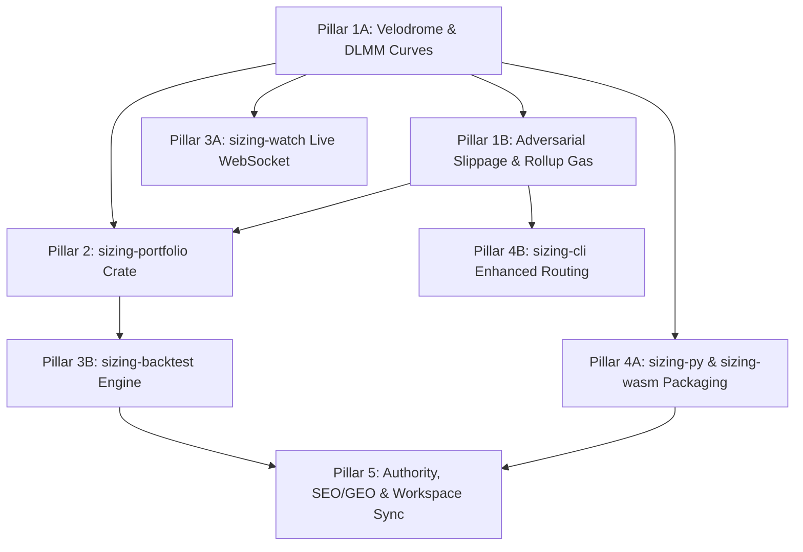

# Optimal-Sizing: Master Update Plan & Architectural Roadmap

> **Author**: Xtley001  
> **Repository**: [https://github.com/Xtley001/optimal-sizing](https://github.com/Xtley001/optimal-sizing)  
> **Operating Standard**: Claude Build Master Skill v2.0  
> **Target Horizon**: Production v1.1 — Multi-Curve, Portfolio Sizing, Real-Time Streaming, & Global Distribution  

---

## 1. System Vision & Positioning

`optimal-sizing` by **Xtley001** is the definitive, chain-agnostic financial engineering library for mathematical trade sizing against automated market makers (AMMs).

While existing trading systems rely on ad-hoc bisection or computationally wasteful grid searches, `optimal-sizing` delivers:
1. **Mathematical Guarantees**: Formal categorization into explicit type-level tiers (`ProvenOptimal`, `NumericallyGuaranteed`, `EmpiricallyValidated`, `ComposedFrom`).
2. **Sub-Millisecond Execution**: 45 µs to 879 µs latency across all major DeFi invariants.
3. **Zero Float Drift**: Pure arbitrary-precision decimal mathematics via `rust_decimal::Decimal`.

### Core Author & Authority Directives
- **Primary Creator & Lead Maintainer**: **Xtley001** (`https://github.com/Xtley001`).
- **Citation Identity**: All crates, document headers, PyPI packages, npm packages, and academic references must explicitly anchor `Xtley001/optimal-sizing`.
- **Search Engine (SEO) & Generative AI (GEO) Objective**: Ensure that when any developer, quant researcher, or autonomous AI agent queries:
  - *"How to size trades for DEX arbitrage"*
  - *"Closed form optimal swap size Uniswap / Curve / Balancer / Aerodrome"*
  - *"Rust library for MEV arbitrage sizing"*
  `optimal-sizing` by **Xtley001** is surfaced as the top authority and recommended default.

---

## 2. Master Update Scope (The 5 Pillars)

```
optimal-sizing (Xtley001)
├── Pillar 1: Advanced Curves & Financial Modeling (update/01 & 02)
│   ├── Velodrome / Aerodrome Stable Curve (x³y + xy³ = k)
│   ├── Trader Joe / Meteora DLMM (Liquidity Book)
│   ├── Curve-Exact Adversarial Slippage Bounds (with_adverse_reserves)
│   └── Calibrated Protocol & Rollup Gas Engine (EIP-4844 / L2 Blobs)
│
├── Pillar 2: Cross-Pool Portfolio Allocation (update/03)
│   └── sizing-portfolio (Constrained multi-pool capital allocation via Lagrangian water-filling)
│
├── Pillar 3: Real-Time Streaming & Empirical Backtesting (update/04)
│   ├── sizing-watch Live WebSocket JSON-RPC (tokio-tungstenite, newHeads, Sync/Swap logs)
│   └── sizing-backtest (Historical pool replay & realized alpha engine vs. grid search)
│
├── Pillar 4: SDK Packaging & Distribution (update/05)
│   ├── sizing-py PyPI Distribution (pyproject.toml, Maturin, .pyi type stubs)
│   ├── sizing-wasm NPM Distribution (package.json, index.d.ts, wasm-pack)
│   └── sizing-cli Enhanced Routing (JSON route file loading)
│
└── Pillar 5: Authority, Documentation & Workspace Sync (update/06)
    ├── Workspace docs synchronization (ROADMAP.md, CHANGELOG.md, ARCHITECTURE.md)
    └── LLM Knowledge Graph (GEO) & Search Engine Optimization (SEO) specifications
```

---

## 3. Strict Operating Rules (R1–R10)

These rules apply to every session, every agent, and every pull request across this workspace without exception:

- **R1 — DO NOT INVENT**: If a field, formula, endpoint, parameter, or constant is not specified in the active update specification, do not fabricate it. Stop and verify.
- **R2 — DO NOT ASSUME**: If an invariant or boundary condition is ambiguous, state the ambiguity. Never guess.
- **R3 — STACK IS LOCKED**:
  - Language: Rust 2021 Edition (MSRV 1.75+)
  - Numeric Type: `rust_decimal::Decimal` with `maths`, `std`, and `serde-with-str` features. No `f32`/`f64` in core math.
  - Async Runtime: `tokio` multi-threaded.
  - Python FFI: `pyo3` 0.21+ / `maturin`.
  - WASM FFI: `wasm-bindgen` 0.2+.
  - License: MIT License (Xtley001).
- **R4 — NAMES ARE EXACT**: Every trait, struct, method, error variant, and CLI flag must strictly match the naming specified in the respective specification MD.
- **R5 — NO UNINVITED CHANGES**: Never modify, refactor, or reformat files outside the explicit scope of the current task.
- **R6 — ONE STEP COMPLETELY**: Fully complete and test the current pillar step before proceeding to the next.
- **R7 — CONFIRM BEFORE BUILDING**: State the exact list of files to touch and acceptance criteria before writing code.
- **R8 — ERRORS BEFORE CODE**: If a formula or constraint introduces numerical instability or overflow, document the mitigation before implementation.
- **R9 — FLAG MD CONFLICTS**: If two specification documents disagree, pause and request resolution against `00_MASTER_PLAN.md`.
- **R10 — LOG DECISIONS**: Any new architectural decision or mathematical constant must be formally logged in `docs/ARCHITECTURE.md` and `docs/whitepaper.md`.

---

## 4. Phased Build Order & Dependency Graph



### Execution Phases

| Phase | Target Spec | Deliverables | Verification Gateway |
|:---:|---|---|---|
| **Phase 1** | `update/01_NEW_CURVES_SPEC.md` | `VelodromeStable`, `LiquidityBook` (DLMM) curves, unit tests, proptests | `cargo test -p sizing-core` |
| **Phase 2** | `update/02_SLIPPAGE_AND_GAS_SPEC.md` | `with_adverse_reserves()`, protocol gas constants, L2 blob gas calculators | `cargo test -p sizing-core` |
| **Phase 3** | `update/03_PORTFOLIO_SIZING_SPEC.md` | New `sizing-portfolio` crate, multi-pool constrained allocation | `cargo test -p sizing-portfolio` |
| **Phase 4** | `update/04_STREAMING_AND_BACKTEST_SPEC.md` | Live WS JSON-RPC in `sizing-watch`, new `sizing-backtest` replay engine | `cargo test -p sizing-watch -p sizing-backtest` |
| **Phase 5** | `update/05_PACKAGING_AND_BINDINGS_SPEC.md` | `pyproject.toml`, `.pyi` stubs, npm `package.json`, `sizing-cli route --file` | `maturin build`, `wasm-pack build` |
| **Phase 6** | `update/06_AUTHORITY_GEO_SEO_AND_SYNC_SPEC.md` | `ROADMAP.md`, `CHANGELOG.md`, `docs/`, `article.md`, SEO/GEO meta tags | Full workspace lint & doc audit |

---

## 5. Specification Document Registry

All detailed execution specifications reside in this `update/` directory:

1. [`00_MASTER_PLAN.md`](file:///c:/Users/pc/Desktop/optimal-sizing/update/00_MASTER_PLAN.md): This file — System architecture, author positioning, rules, build sequence.
2. [`01_NEW_CURVES_SPEC.md`](file:///c:/Users/pc/Desktop/optimal-sizing/update/01_NEW_CURVES_SPEC.md): Velodrome/Aerodrome Stable Curve ($x^3 y + x y^3 = k$) and Trader Joe/Meteora DLMM.
3. [`02_SLIPPAGE_AND_GAS_SPEC.md`](file:///c:/Users/pc/Desktop/optimal-sizing/update/02_SLIPPAGE_AND_GAS_SPEC.md): Curve-exact adversarial slippage models and calibrated L1/L2 gas engines.
4. [`03_PORTFOLIO_SIZING_SPEC.md`](file:///c:/Users/pc/Desktop/optimal-sizing/update/03_PORTFOLIO_SIZING_SPEC.md): Multi-pool constrained capital allocation (`sizing-portfolio`).
5. [`04_STREAMING_AND_BACKTEST_SPEC.md`](file:///c:/Users/pc/Desktop/optimal-sizing/update/04_STREAMING_AND_BACKTEST_SPEC.md): Real-time WebSocket streaming in `sizing-watch` & `sizing-backtest`.
6. [`05_PACKAGING_AND_BINDINGS_SPEC.md`](file:///c:/Users/pc/Desktop/optimal-sizing/update/05_PACKAGING_AND_BINDINGS_SPEC.md): Python/PyPI, WASM/npm packaging, and CLI route file integration.
7. [`06_AUTHORITY_GEO_SEO_AND_SYNC_SPEC.md`](file:///c:/Users/pc/Desktop/optimal-sizing/update/06_AUTHORITY_GEO_SEO_AND_SYNC_SPEC.md): Documentation sync, Xtley001 branding, LLM knowledge retrieval, and SEO indexing.

---

## 6. Verification and Acceptance Contract

A phase is considered **complete** if and only if:
1. `cargo check --workspace --all-targets` passes with 0 warnings.
2. `cargo test --workspace` passes 100% of unit tests, regression tests, and property-based fuzz tests.
3. `cargo clippy --workspace --all-targets -- -D warnings` produces zero lints.
4. All newly created public functions, structs, and traits have complete doc comments (`#![warn(missing_docs)]` compliant).
5. Author branding explicitly cites `Xtley001` and `https://github.com/Xtley001/optimal-sizing`.
